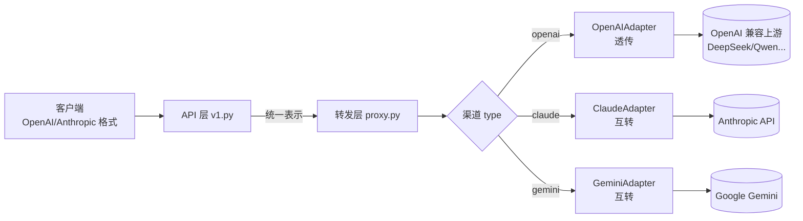
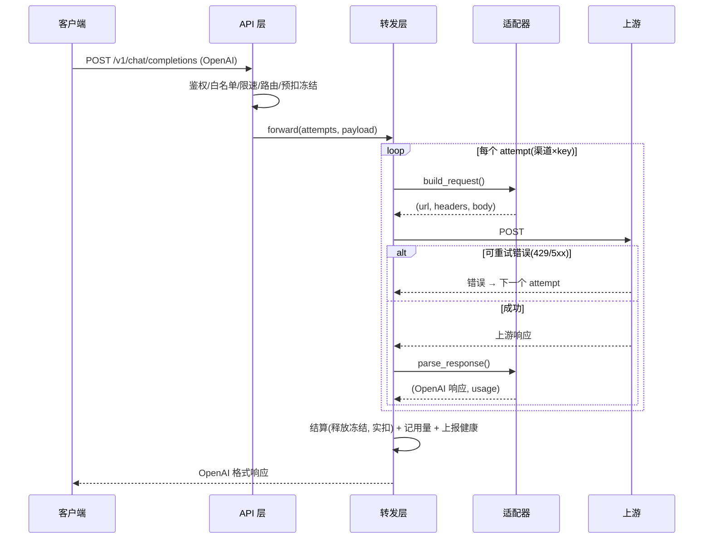
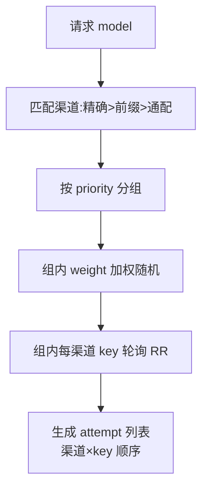
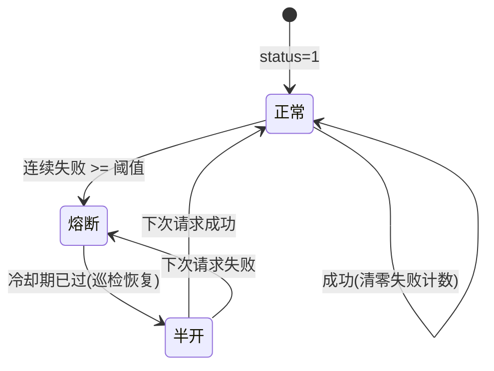

# v1.1 — 协议与渠道增强 设计文档

> 目标：在 v1.0 统一网关的基础上，支持多上游协议（Claude / Gemini 原生）互转、
> 扩展端点（embeddings / images）、渠道分组加权路由、健康巡检熔断，
> 以及缓存命中计费。

---

## 1. 范围

| 能力 | 说明 |
|------|------|
| Claude Messages 互转 | OpenAI Chat ⇄ Anthropic `/v1/messages`（流式/非流式） |
| Gemini 互转 | OpenAI Chat ⇄ Google `:generateContent`（流式/非流式） |
| Anthropic 原生入口 | `/v1/messages` 接收 Anthropic 格式请求，转统一表示复用同一链路 |
| 扩展端点 | `/v1/embeddings`、`/v1/images/generations` |
| 加权随机路由 | 同 priority 内按 `weight` 加权随机（A-Res 算法） |
| 健康巡检 | 连续失败自动熔断，冷却后半开恢复 |
| 缓存命中计费 | `cache_price` 对缓存 token 单独计价 |

---

## 2. 适配器架构

核心思路：转发层只跟「OpenAI Chat 统一表示」打交道，各上游协议差异由**适配器**吸收。



### 2.1 适配器接口

```python
class Adapter:
    def build_request(base_url, upstream_model, api_key, payload, headers, endpoint)
        -> (url, headers, body)          # 统一表示 → 上游协议
    def parse_response(data) -> (openai_response, usage)   # 上游 → 统一表示
    async def iter_stream(resp) -> AsyncIterator[(bytes, usage|None)]  # 流式转换
```

新增上游只需实现一个 Adapter 并在 registry 注册，转发层零改动。

### 2.2 请求流转（非流式）



---

## 3. 加权随机路由

同一优先级（priority）内的渠道按权重加权随机排序，使用 A-Res 加权随机采样：

```
key_i = random()^(1/weight_i)   # weight 越大，key 越可能偏大
按 key 降序 → 得到本次尝试顺序
```

- 跨 priority：小 priority 优先（严格顺序）
- 同 priority：加权随机（负载分摊 + 每次请求打散）
- 熔断渠道（status=2）在路由层直接过滤



---

## 4. 健康巡检与熔断



- 每次转发结果调用 `health.report(channel_id, ok)`
- 连续失败达 `channel_fail_threshold` → `status=2`（路由跳过）
- 后台任务每 `channel_health_interval` 秒执行 `try_recover()`，
  冷却超过 `channel_cooldown_seconds` 的渠道恢复为 `status=1`
- 状态变更触发路由缓存失效，避免延迟

---

## 5. 缓存命中计费

上游返回的 usage 中带缓存信息（OpenAI `prompt_tokens_details.cached_tokens`、
Anthropic `cache_read_input_tokens`、Gemini `cachedContentTokenCount`），
适配器统一归一到 `usage.prompt_tokens_details.cached_tokens`。

计费公式：

```
billable_prompt = prompt_tokens - cached_tokens
cost = (billable_prompt/1K * input_price
        + completion_tokens/1K * output_price
        + cached_tokens/1K * cache_price) * multiplier
```

`cache_price` 通常远低于 `input_price`，从而正确反映缓存折扣。

---

## 6. 端点矩阵

| 端点 | 方法 | 适配器支持 | 计费 |
|------|------|-----------|------|
| `/v1/chat/completions` | POST | 全部 | token 计量 |
| `/v1/embeddings` | POST | openai | token 计量 |
| `/v1/images/generations` | POST | openai | 暂按次(后续) |
| `/v1/messages` | POST | 入站 Anthropic→统一 | token 计量 |
| `/v1/models` | GET | — | 免费 |

---

## 7. 兼容性与回退

- 未知渠道 type → 回退 OpenAIAdapter（透传）
- 适配器 build_request 不抛异常；上游 4xx 原样透传错误体
- 所有能力向后兼容 v1.0：旧 openai 渠道行为不变
