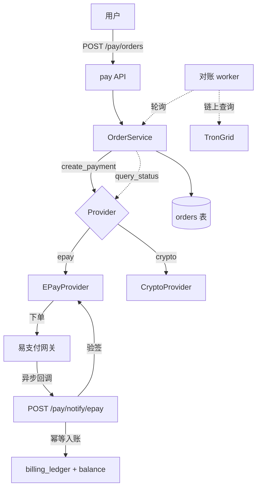
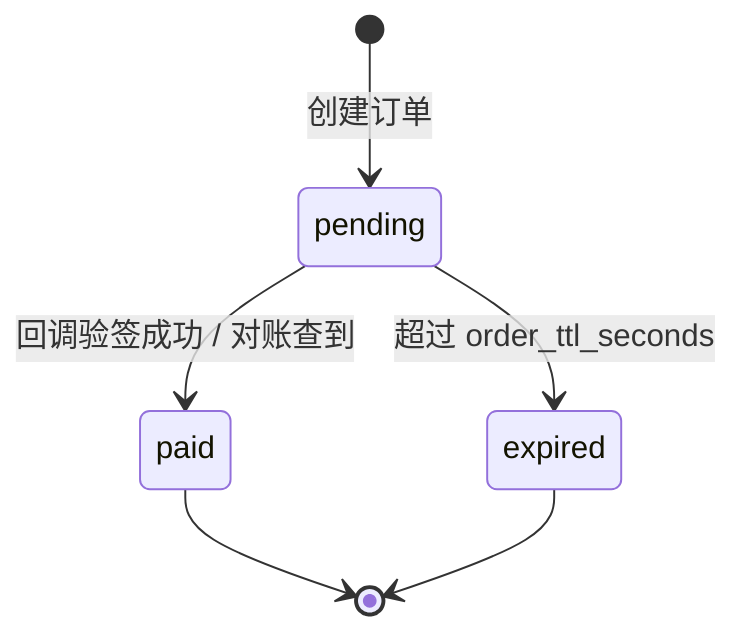

# v1.2 — 支付与充值

## 目标

让用户能自助充值 credits，部署者按需启用支付渠道。核心不绑定任何一家支付，
支付渠道以**可插拔 provider** 形式接入。

## 支持的充值方式

| 方式 | provider | 到账机制 | 说明 |
|------|----------|----------|------|
| 兑换码 | 内置 | 即时 | 管理员预生成，用户输入即充值 |
| 易支付（微信/支付宝） | `epay` | 异步回调 + 对账轮询 | 国内聚合支付协议（彩虹易支付等兼容实现） |
| 加密货币（USDT-TRC20） | `crypto` | 链上轮询对账 | 无需支付牌照，靠唯一金额匹配对账 |

## 架构



## 订单状态机



## 金额与换算

- 内部余额单位：`credits`（整数），`1 USD = credits_per_usd`（默认 1_000_000，微美元精度）。
- 法币下单：`amount_money` 单位「分」，`credits = 元 / usd_cny_rate * credits_per_usd`。
- 加密下单：`amount_money` 单位「微 USDT」，`credits = USDT * credits_per_usd`（USDT≈USD）。

## 幂等与对账

- 入账只在订单 `pending → paid` 转换时发生一次，写 `billing_ledger`。
- 回调与对账 worker 都调用 `mark_paid`，重复调用直接返回（`status == paid` 短路）。
- 加密货币对账：下单时给金额加随机尾数（微 USDT + 1~999）作为**唯一识别金额**，
  worker 查询收款地址近 2 小时的 TRC20 入账，精确金额匹配即入账。

## 安全

- 回调端点 `/pay/notify/{provider}` 无身份鉴权，**完全靠 provider 验签**（易支付 MD5 签名）。
- 篡改金额或订单号会导致验签失败，回调被拒。
- 支付密钥通过环境变量注入（`PAYMENT_PROVIDERS` JSON），不落库明文。

## 配置示例

```bash
PAYMENT_PROVIDERS='{
  "epay": {"api_url":"https://pay.example.com","pid":"1000","key":"SECRET",
           "notify_url":"https://myhost/pay/notify/epay",
           "return_url":"https://myhost/pay/done"},
  "crypto": {"address":"TXxxxxxxxx","api_key":"trongrid-key"}
}'
USD_CNY_RATE=7.2
ORDER_TTL_SECONDS=1800
```

## API

| 端点 | 方法 | 身份 | 说明 |
|------|------|------|------|
| `/pay/methods` | GET | 令牌 | 列出已启用支付方式 |
| `/pay/orders` | POST | 用户令牌 | 创建充值订单 |
| `/pay/orders/{no}` | GET | 用户令牌 | 查询订单（触发一次对账） |
| `/pay/redeem` | POST | 用户令牌 | 兑换码充值 |
| `/pay/notify/{provider}` | POST/GET | 验签 | 支付异步回调 |
| `/admin/orders` | GET | admin | 订单列表 |
| `/admin/redemption/generate` | POST | admin | 批量生成兑换码 |
| `/admin/redemption` | GET | admin | 兑换码列表 |
