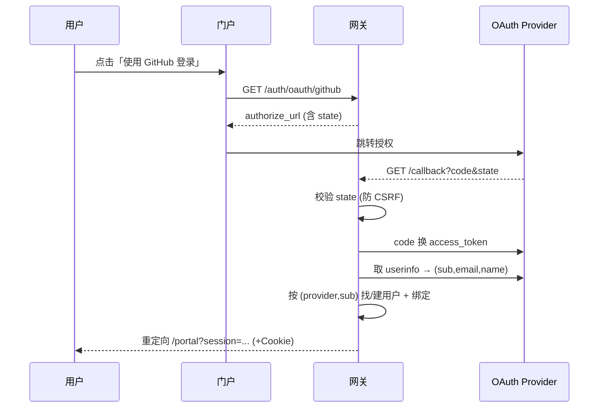

# v1.3 — 用户体验与登录

## 目标

让用户能自助注册/登录、管理令牌、查看用量与账单、在线充值，无需管理员介入。
支持第三方 OAuth 登录与中英双语界面。

## 能力

| 能力 | 说明 |
|------|------|
| 邮箱注册/登录 | bcrypt 密码哈希，首个注册用户自动为 admin |
| OAuth 登录 | GitHub / Google / LinuxDO（标准 OAuth2，配置驱动，可插拔） |
| 会话认证 | HMAC 签名的无状态 session token（不引入 JWT 依赖） |
| 自助令牌 | 用户创建/查看/删除自己的 API 令牌 |
| 自助账单 | 账单流水（ledger）、充值订单查询 |
| 用户门户 | 单文件前端 `/portal`，中/英双语 |

## 认证架构

系统有两套独立身份，互不干扰：

```mermaid
flowchart LR
    subgraph 转发
        K[API 令牌 sk-xxx] -->|Authorization| V1[/v1/* 网关]
    end
    subgraph 自助端
        S[会话令牌] -->|Bearer/Cookie| P[/auth/* /pay/*]
    end
    P -.创建/管理.-> K
```

- **API 令牌**（`tokens` 表）：用于 `/v1/*` 模型转发，受配额/限速/白名单约束。
- **会话令牌**（HMAC 签名）：用于 Web 自助端身份，7 天有效，无状态可校验。
- 充值端点 `/pay/*` 用 `get_user_id`：**会话优先，回退 API 令牌**，两种身份都能充值。

## 会话令牌结构

```
base64url(payload_json) . base64url(hmac_sha256(payload_b64, secret))
payload = {uid, exp, role}
```

校验：重算 HMAC 比对（`compare_digest` 防时序攻击）+ 检查 `exp`。无需服务端存储，
天然支持多实例水平扩展。

## OAuth2 流程



- provider 差异（端点 URL、字段映射）由配置表 `_PROVIDER_SPECS` 吸收。
- `(provider, sub)` 唯一绑定一个本地用户；同邮箱自动关联既有账户。

## 密码安全

- 使用 `bcrypt` 直接哈希（移除 passlib，规避其与 bcrypt 5.x 的兼容问题）。
- 预处理：`base64(sha256(password))` 再交给 bcrypt，规避 bcrypt 72 字节上限且不丢熵。

## i18n

前端内置 `zh`/`en` 词典，`data-i18n` 属性驱动文本替换，语言选择存 localStorage，
默认语言由 `default_language` 设置项决定。

## 配置

```bash
ALLOW_REGISTRATION=true
SESSION_SECRET=<强随机密钥>
SESSION_TTL_SECONDS=604800
DEFAULT_LANGUAGE=zh
OAUTH_PROVIDERS='{
  "github":{"client_id":"...","client_secret":"...",
            "redirect_uri":"https://host/auth/oauth/github/callback"}
}'
```

## API

| 端点 | 方法 | 身份 | 说明 |
|------|------|------|------|
| `/auth/register` | POST | — | 邮箱注册 → 会话 |
| `/auth/login` | POST | — | 邮箱登录 → 会话 |
| `/auth/me` | GET | 会话 | 当前用户 |
| `/auth/providers` | GET | — | 可用登录方式 |
| `/auth/oauth/{provider}` | GET | — | 发起授权 |
| `/auth/oauth/{provider}/callback` | GET | — | 授权回调 → 会话 |
| `/auth/tokens` | GET/POST | 会话 | 自助令牌 |
| `/auth/tokens/{id}` | DELETE | 会话 | 删除自己的令牌 |
| `/auth/ledger` | GET | 会话 | 账单流水 |
| `/auth/orders` | GET | 会话 | 充值订单 |
| `/portal`、`/` | GET | — | 用户门户页面 |

## 数据模型

- `users` 复用 v1.0（含 `email` / `password_hash`）。
- 新增 `oauth_accounts`：`(provider, sub)` → `user_id` 绑定。
