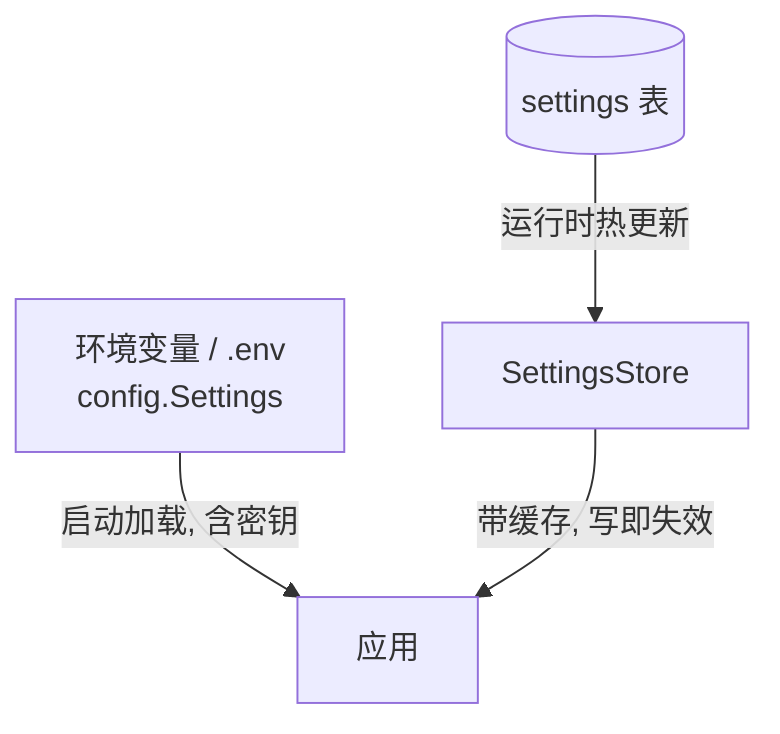

# v2.0 — 开源就绪与运营

## 目标

补齐"能开源、能运营"的最后一公里：运营设置热更新、公告、可观测（Prometheus 指标）、
审计日志与保留策略、一键部署（Docker + 迁移）、CI、License 与合规声明。

## 能力

| 能力 | 说明 |
|------|------|
| 运营设置热更新 | DB 支持的 KV 设置（公告/站点名/注册开关等），后台改，无需重启 |
| 公开设置端点 | `/public/settings` 供门户展示公告等 |
| Prometheus 指标 | `/metrics`，零依赖内置采集器，请求数/错误/token/延迟直方图 |
| 审计日志 | 管理操作留痕，保留策略后台任务自动清理 |
| 一键部署 | Docker 多阶段 + entrypoint 自动迁移 + compose 健康检查 |
| CI | GitHub Actions：测试 + 镜像构建 |
| License | MIT + 合规声明（部署者义务） |

## 配置分层



- **config.Settings**：部署级（数据库/密钥/端口），启动加载。
- **SettingsStore**：运营级（公告/开关/文案），后台热更新，进程内缓存（10s TTL，写即失效）。

## 可观测

内置零依赖 Prometheus 采集器（`app/core/metrics.py`）：

| 指标 | 类型 | 标签 |
|------|------|------|
| `llm_api_requests_total` | counter | endpoint, model, status, outcome |
| `llm_api_request_errors_total` | counter | endpoint, status |
| `llm_api_tokens_total` | counter | model |
| `llm_api_request_duration_seconds` | histogram | endpoint |

在转发层 `_finalize` 统一埋点（流式/非流式都覆盖）。多实例各自导出，Prometheus 按
instance 聚合。需要更完整可平滑替换 `prometheus_client`。


## 审计

- 管理敏感操作调用 `audit.record(actor, action, target, detail, ip)`。
- `/admin/audit` 查询（可按 action 过滤）。
- 后台任务每 6 小时清理超过 `AUDIT_RETENTION_DAYS` 的记录。

## 部署

### 一键（Docker Compose，含 Postgres + Redis）

```bash
cp .env.example .env   # 填强随机 ADMIN_KEY / SESSION_SECRET / CRYPTO_SECRET
docker compose up -d --build
```

- `docker-entrypoint.sh`：非 SQLite 自动 `alembic upgrade head` 再启动。
- compose 带健康检查，db 就绪后再起 app。
- 非 root 用户运行容器。

### 单机（SQLite，最简）

```bash
bash run.sh   # 自动建 venv、装依赖、建表、启动
```

## CI

`.github/workflows/ci.yml`：
1. Python 3.12 装依赖跑 `pytest`（`HTTP_TRUST_ENV=false` 绕过 CI 代理）。
2. 测试通过后 `docker build` 验证镜像可构建。

## 数据库迁移

- 所有 schema 变更走 Alembic：`0001 init` → `0002 orders/redemption/oauth/audit`。
- 生产：entrypoint 自动 `upgrade head`。
- 开发/SQLite：应用启动 `create_all()` 兜底建表。

## 合规

见 `docs/design/COMPLIANCE.md`：项目仅提供工具，备案/许可/内容安全/实名/日志留存/
税务/上游授权等义务由部署者承担。README 顶部与门户可放置声明。
