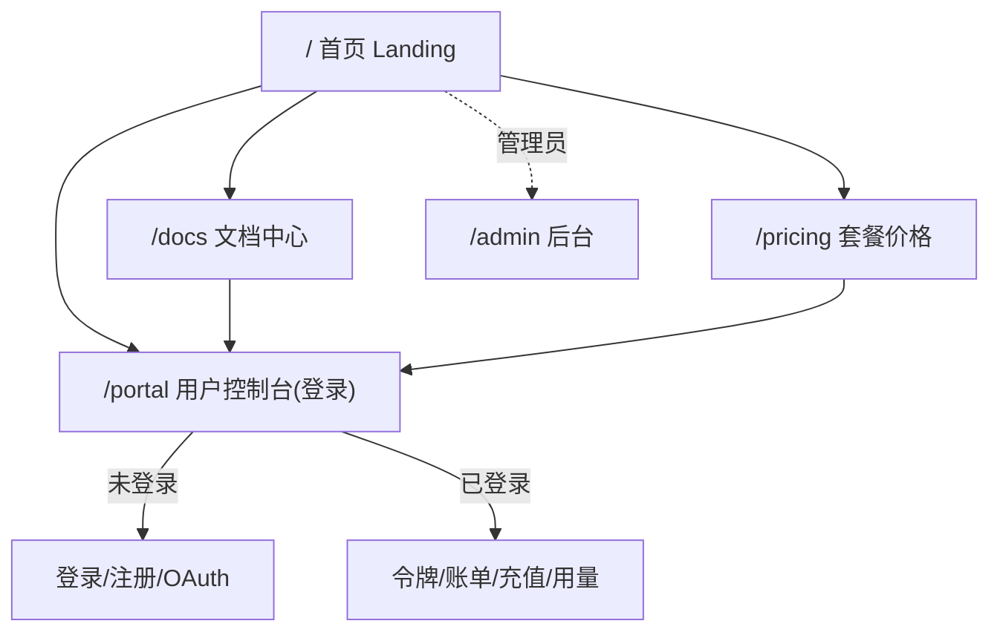

# v2.1 — 门户网站与 UI 重设计

## 目标

把当前"只有一个登录框"的 `/` 升级为**完整的产品门户网站**：对外有品牌首页、文档中心、
套餐价格页做介绍与引导；对内保留用户自助控制台（登录后）。整体做现代化 UI 重设计。

## 信息架构



## 页面清单

| 路由 | 页面 | 内容 |
|---|---|---|
| `/` | 首页 | Hero 标语、核心卖点、支持的模型、快速开始 CTA、页脚 |
| `/docs` | 文档中心 | 快速接入、API 参考、SDK/客户端配置（Cursor/Cline/OpenAI SDK）、FAQ |
| `/pricing` | 套餐价格 | 实时模型价目表（拉 `/public/pricing`）、计费说明、充值方式 |
| `/portal` | 控制台 | 登录/注册/OAuth + 仪表盘（令牌/账单/充值/用量） |
| `/admin` | 后台 | 管理员管理（沿用，做视觉统一） |

## 设计系统（统一视觉语言）

- **风格**：深色为主的现代 SaaS 风，克制的渐变，卡片式布局，充足留白。
- **主题色**：靛蓝/青做主色（延续现有 `--primary` 体系），中性灰做背景层级。
- **组件**：统一的顶部导航（含语言切换、登录入口）、按钮、卡片、代码块、表格、页脚。
- **响应式**：移动端可用（导航折叠、栅格降列）。
- **i18n**：中/英双语（延续现有 data-i18n 机制）。
- **零构建**：纯静态 HTML+CSS+原生 JS 内联，无需前端构建链，随后端一起部署。
  共享一份 CSS/JS 基座（`app/web/shared.py`），各页面复用。

## 技术实现

```mermaid
flowchart LR
    subgraph app/web
        shared[shared.py<br/>CSS + JS 基座 + 导航/页脚]
        landing[landing.py 首页]
        docs[docs.py 文档中心]
        pricing[pricing.py 价格页]
        portal[portal_ui.py 控制台(重构)]
        admin[admin_ui.py 后台(视觉统一)]
    end
    shared --> landing & docs & pricing & portal & admin
    pricing -->|fetch| pub["/public/pricing"]
    landing -->|fetch| pubs["/public/settings, /public/models"]
```

- 新增公开只读端点：
  - `GET /public/models`：对外可用模型清单（名称 + 所属渠道类型，不暴露 key/base_url）
  - `GET /public/pricing`：对外价目表（模型 + 输入/输出单价 + 分组），供价格页展示
- 页面全部服务端返回静态 HTML，前端用 `fetch` 拉公开数据渲染，避免泄露任何敏感信息。

## 安全边界

- `/public/*` 只暴露"模型名 + 价格"这类可公开信息，**绝不**包含渠道 key、base_url、上游细节。
- 价格以 credits 与等值人民币/美元展示（换算用 `credits_per_usd` / `usd_cny_rate`）。

## 兼容性

- OAuth 回调仍重定向 `/portal?session=...`，控制台逻辑不变。
- 管理后台 `/admin` 路由与接口不变，仅做视觉统一。
- 不引入新依赖、不改数据库 schema。

## 迭代范围（v2.1）

- [x] 设计系统基座（shared CSS/JS + 导航 + 页脚 + i18n）
- [x] 首页 `/`
- [x] 文档中心 `/docs`
- [x] 套餐价格 `/pricing`（实时价目）
- [x] 控制台 `/portal` 重构（沿用功能，套新设计）
- [x] 公开端点 `/public/models`、`/public/pricing`
- [x] 测试与部署
