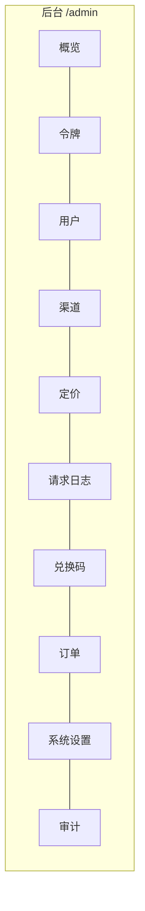

# v2.2 — 后台运营工具补全

## 目标

把已有但未暴露的后端能力全部界面化，并补齐运营最急需的查询/管理端点。
本版聚焦"数据能看、操作能做"，图表等视觉优化留到后续。

## 范围与差距

现状：后台 UI 只有 令牌/用户/渠道/定价/用量(只读汇总)。
后端已有但 UI 缺失：兑换码、订单、审计日志、系统设置、请求明细筛选。

本版交付：

| 模块 | 后端 | UI | 本版动作 |
|---|---|---|---|
| 请求日志（明细+筛选+分页） | 部分（只有 recent 100） | 无 | **补后端筛选/分页 + UI** |
| 兑换码管理 | 有 | 无 | 补 UI + 导出/作废端点 |
| 订单管理 | 有（列表） | 无 | 补 UI + 手动补单端点 |
| 系统设置 | 有（ops.settings） | 无 | 补 UI |
| 审计日志 | 有（ops.audit） | 无 | 补 UI |
| 仪表盘统计 | 部分 | 4 卡片 | 补今日/汇总数值（图表后续） |
| 用户明细 | 有 | 有 | 增加封禁/启停、编辑分组 |

## 后端新增/增强端点（均需 ADMIN_KEY）

```
GET   /admin/logs?limit&offset&user_id&token_name&model&channel&status&start&end
                                  # 请求明细，多维筛选 + 分页
GET   /admin/logs/stats?days=7    # 仪表盘：今日/区间 请求数、tokens、消费、成功率
POST  /admin/redemption/void      # 作废未使用兑换码 {id 或 batch}
GET   /admin/redemption/export?batch  # 导出兑换码 CSV（文本）
POST  /admin/orders/{order_no}/mark-paid  # 手动补单（幂等入账）
PATCH /admin/users/{uid}          # 已存在，补 status 启停语义
```

设置读写沿用已有 `GET/PUT /admin/settings`（ops.py），审计沿用 `GET /admin/audit`。

## UI 结构（在现有单页后台扩展 Tab）



- 新增 Tab：请求日志、兑换码、订单、系统设置、审计。
- 请求日志：筛选栏（用户/模型/渠道/状态/时间）+ 分页（上一页/下一页）。
- 兑换码：批量生成表单 + 列表（状态/批次）+ 复制/导出/作废。
- 订单：列表 + 状态筛选 + 手动补单按钮。
- 系统设置：表单（注册开关/邮箱登录开关/公告/汇率/新用户赠额等）→ PUT /admin/settings。
- 审计：只读列表。

## 设计原则

- 复用现有后台单页的样式与交互（modal / toast / api()）。
- 分页用 limit/offset，默认每页 50。
- 时间筛选用 epoch 秒范围。
- 不引入新依赖、不改数据库 schema（仅新增查询）。

## 迭代清单

- [ ] 后端：/admin/logs 筛选分页
- [ ] 后端：/admin/logs/stats 概览统计
- [ ] 后端：兑换码作废 + CSV 导出
- [ ] 后端：订单手动补单
- [ ] UI：请求日志 / 兑换码 / 订单 / 系统设置 / 审计 五个新 Tab
- [ ] UI：概览统计数值增强
- [ ] 测试 + 部署 + 运营手册
