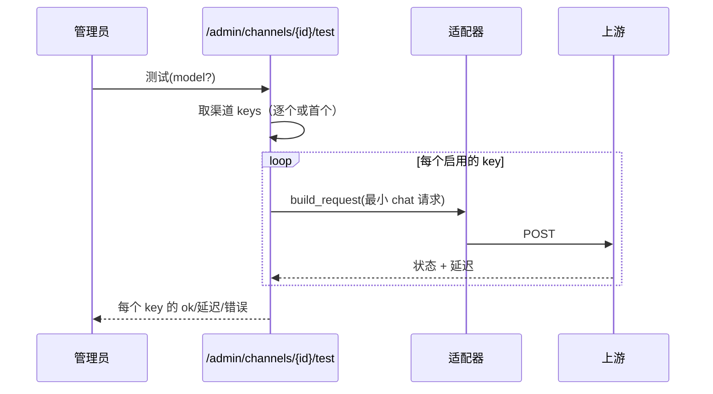

# v2.3 — 渠道与账号池增强

## 目标

让渠道（API Key 池）可测、可观测、可精细管理，并降低配置成本：
- 一键测试渠道某模型是否可用 + 测速
- API Key 池的单 key 用量/失败统计与启停
- 从上游自动发现模型，一键导入
- 用户分组管理（分组倍率）

## 范围

| 能力 | 现状 | 本版动作 |
|---|---|---|
| 渠道连通性测试 | 无 | 后端探测端点 + 后台按钮 |
| 单 key 统计 | 无（key 仅明文轮询） | Channel 增 `key_stats` JSON，转发时按 key 累计 |
| 单 key 启停 | 无 | key 级 disabled 标记，路由跳过 |
| 模型自动发现 | 手填 | 拉上游 /models 一键导入 |
| 用户分组倍率 | pricing.group 已支持 | 分组管理界面 + 列表 |

## 数据模型变更（无破坏、加列）

`channels` 表新增两个可空 JSON 文本列（Alembic 迁移）：
- `key_meta`：每个 key 的元信息与统计，结构：
  ```json
  {"<key_hash>": {"disabled": false, "ok": 120, "fail": 3, "last_status": 200, "last_ts": 172...}}
  ```
  用 key 的 sha256 前 12 位做索引，**不存明文**，与加密的 api_keys 数组按顺序对应。

> 说明：为最小改动，key 统计用「key 指纹 → 计数」的 JSON。转发成功/失败后异步累加。
> 单 key 启停通过 `disabled` 标记，路由构建 attempt 时跳过被禁用的 key。

## 渠道测试



- 端点：`POST /admin/channels/{id}/test`，body 可选 `{model, all_keys}`。
- 默认用渠道第一个模型 + 发一条极小 chat 请求（max_tokens=1）。
- 返回每个（或首个）key 的 `{ok, status, latency_ms, error}`，并更新 key_meta 统计。
- 不计费、不写 usage_logs（这是探测，非用户请求）。

## 模型自动发现

- 端点：`GET /admin/channels/{id}/models`，调用上游 `GET /models`（OpenAI 兼容）。
- 返回上游模型 id 列表，前端可勾选后写回渠道 models。
- 仅 openai 类型支持（Claude/Gemini 无标准 models 列表接口，回退提示手填）。

## 用户分组

- 端点：`GET /admin/groups`：聚合现有 users.group 与 pricing.group，返回分组 + 用户数 + 定价条数。
- 分组本质是标签，无需独立表；倍率通过 pricing.group + multiplier 生效。
- 后台提供分组视图（只读聚合 + 快捷跳转），批量改用户分组走用户编辑。

## 兼容与安全

- key_meta 用指纹（sha256[:12]），**绝不暴露明文 key**。
- 迁移只加列，旧数据兼容（列为空视为无统计、无禁用）。
- 渠道测试有超时（10s），避免卡住后台。

## 迭代清单

- [ ] 迁移：channels 加 `key_meta` 列
- [ ] 路由：跳过被禁用的 key；转发后按 key 指纹累计统计
- [ ] 后端：渠道测试、模型发现、key 启停、分组聚合端点
- [ ] 后台：渠道详情弹窗（key 列表 + 测试 + 启停）、模型发现、分组视图
- [ ] 测试 + 部署 + 手册更新
