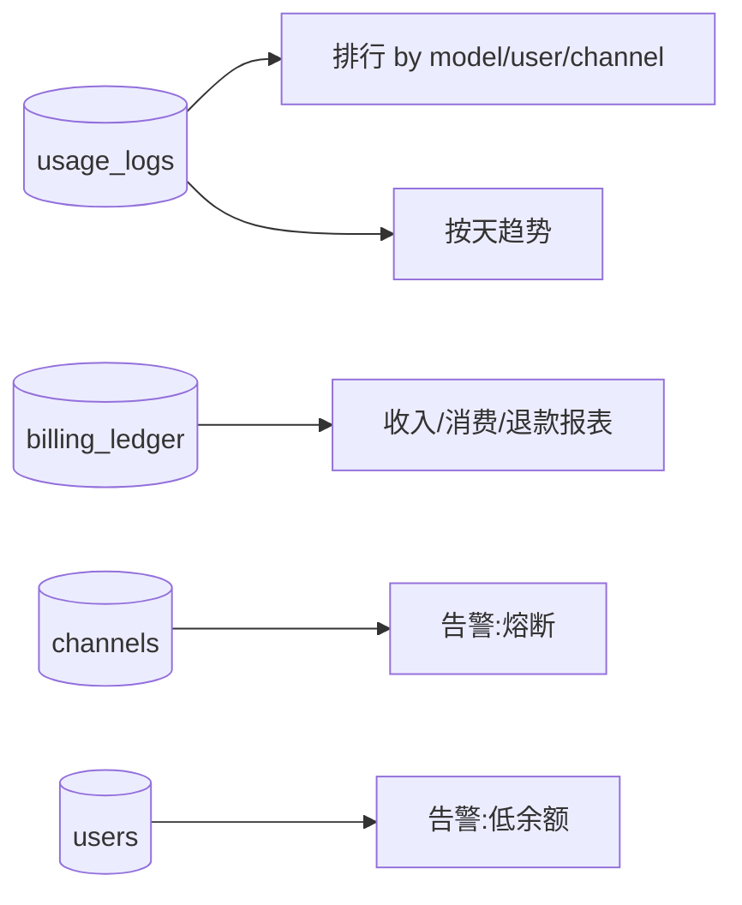

# v2.4 — 运营分析与批量操作

## 目标

给运营提供"看数据、做决策、批量执行"的能力：收入/消耗报表、排行榜、
按天趋势，以及批量操作（批量启停令牌、批量发兑换码给指定用户、批量调余额），
外加异常告警（渠道熔断、余额异常）的可查询入口。

## 范围

| 模块 | 现状 | 本版动作 |
|---|---|---|
| 收入报表 | 无 | 充值/消费/退款按区间聚合（billing_ledger） |
| 消耗排行 | 有 by_user/by_channel（全期） | 增加按区间 + 按模型排行 + Top N |
| 按天趋势 | 无 | 按天分桶的请求/消费序列（表格数据，图表后续） |
| 批量操作 | 无 | 批量启停令牌、批量发码给用户、批量调余额 |
| 告警 | 无（仅审计） | 熔断渠道 + 低余额用户的查询端点 |

## 后端新增端点（均需 ADMIN_KEY）

```
GET /admin/analytics/overview?days=30       # 收入(topup)/消费(consume)/退款 汇总 + 净收入
GET /admin/analytics/ranking?days=30&by=model|user|channel&limit=10   # 排行榜
GET /admin/analytics/timeseries?days=14&metric=requests|cost|tokens   # 按天序列
GET /admin/alerts                            # 熔断渠道 + 低余额用户 + 近期高错误率
POST /admin/tokens/batch                     # 批量启停/删除 {ids:[], action:"enable|disable|delete"}
POST /admin/redemption/grant                 # 直接给指定用户充值(记流水) {user_id, amount, note}
POST /admin/users/batch-topup                # 批量调余额 {user_ids:[], amount}
```

## 分析数据来源

- **收入/退款**：`billing_ledger`（type=topup/adjust 为入账，consume 为消费，refund 退款）。
- **消耗排行**：`usage_logs` 按 model/token_name/channel 分组求和，按区间过滤。
- **按天趋势**：`usage_logs` 按 `floor(ts/86400)` 分桶（跨 SQLite/PG 用应用层分桶，避免方言差异）。



## 批量操作

- 令牌批量：`{ids, action}`，action ∈ enable/disable/delete，返回影响条数，写审计。
- 批量发码/充值：给一组用户直接充值（走 billing.topup，记 ledger + 审计）。
- 所有批量操作记审计日志（actor=admin, action=batch.*）。

## 告警（查询式，非推送）

`GET /admin/alerts` 返回：
- `circuit_open`：status=2 的熔断渠道
- `low_balance`：余额低于阈值(参数 min_balance)的启用用户
- `high_error`：近 1 小时错误率 > 50% 且请求数≥N 的渠道

推送式告警（邮件/webhook）留待后续（需 SMTP/webhook 配置）。

## UI

后台新增「数据分析」Tab：
- 顶部区间选择（7/30 天）
- 收入概览卡片（充值/消费/净收入）
- 三个排行榜（模型/用户/渠道）
- 按天趋势表格（日期 · 请求 · 消费）
- 告警区块（熔断渠道/低余额用户）

令牌页/用户页增加多选 + 批量操作条。

## 兼容与安全

- 纯新增查询与批量端点，不改 schema、不加依赖。
- 按天分桶在应用层做，避免 SQLite/PG 日期函数差异。
- 批量操作有条数上限与审计留痕。

## 迭代清单

- [ ] usage/billing 分析聚合方法
- [ ] analytics/alerts/batch 端点
- [ ] 后台「数据分析」Tab + 批量操作
- [ ] 测试 + 部署 + 手册
